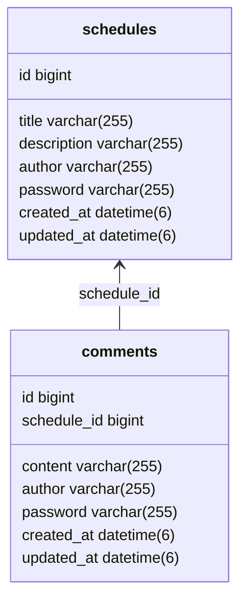

# 개인 일정 관리 서비스 (My Scheduler)

> **Spring Boot와 JPA를 활용한 RESTful 일정 관리 서버입니다.**

---

## 프로젝트 개요
- **설명**: 사용자가 자신의 일정을 등록, 조회, 수정, 삭제할 수 있는 관리 시스템입니다.
- **핵심 가치**: 데이터 무결성을 위한 비밀번호 검증과 JPA Auditing을 활용한 자동화된 시간 기록.

---

## 기술 스택
- **Language**: Java 17
- **Framework**: Spring Boot 3.x
- **Database**: H2 Database
- **ORM**: Spring Data JPA
- **API Test**: Postman, Swagger (OpenAPI 3.0)

---

## 데이터베이스 설계



---

## 실행 방법

### 1. 애플리케이션 실행
* **IDE 사용 시**: `MySchedulerApplication.java` 파일을 실행(Run)합니다.
* **터미널(Gradle) 사용 시**: 프로젝트 루트 경로에서 아래 명령어를 입력합니다.
```bash
./gradlew bootRun
```

### 2. API 테스트 (Swagger)
* **주소**: [http://localhost:8080/swagger-ui/index.html](http://localhost:8080/swagger-ui/index.html)
* **방법**: 접속 후 각 API의 **'Try it out'** 버튼을 클릭하여 요청을 보낼 수 있습니다.

### 3. API 명세서
| 기능 | 메서드 | 엔드포인트                         | 설명 |
| :--- | :---: |:------------------------------| :--- |
| **일정 생성** | `POST` | `/api/schedules`              | 새로운 일정을 등록합니다. (비밀번호 필수) |
| **일정 목록 조회** | `GET` | `/api/schedules`              | 전체 목록 혹은 작성자명 필터 조회를 수행합니다. |
| **일정 단건 조회** | `GET` | `/api/schedules/{scheduleId}` | 특정 ID를 가진 일정의 상세 정보를 조회합니다. |
| **일정 수정** | `PATCH` | `/api/schedules/{scheduleId}` | **비밀번호 일치 시** 일정 제목과 작성자명을 수정합니다. |
| **일정 삭제** | `DELETE` | `/api/schedules/{scheduleId}` | **비밀번호 일치 시** 해당 일정을 완전히 삭제합니다. |

---
## 요구사항 체크리스트

<details>
<summary><b>1️⃣ 필수 기능 체크리스트</b></summary>

### Lv 0. API 명세 및 ERD 작성
- [x] <ins>**API 명세서 작성하기**</ins>
  - [x]  API명세서는 프로젝트 root(최상위) 경로의 `README.md`에 작성
- [x] <ins>**ERD 작성하기**</ins>
  - [x] ERD는 프로젝트 root(최상위) 경로의 README.md에 첨부

### Lv 1. 일정 생성
- [x] <ins>**일정 생성 (일정 작성하기)**</ins>
  - [x] 일정 생성 시, 포함되어야할 데이터
    - [x] `일정 제목`, `일정 내용`, `작성자명`, `비밀번호`, `작성/수정일`을 저장
    - [x] `작성/수정일`은 날짜와 시간을 모두 포함한 형태
  - [x] 각 일정의 고유 식별자(ID)를 자동으로 생성하여 관리
  - [x] 최초 생성 시, `수정일`은 `작성일`과 동일
  - [x] `작성일`, `수정일` 필드는 `JPA Auditing`을 활용하여 적용
  - [x] API 응답에 `비밀번호`는 제외해야 합니다.

### Lv 2. 일정 조회
- [x] <ins>**전체 일정 조회**</ins>
  - [x] `작성자명`을 기준으로 등록된 일정 목록을 전부 조회
      - [x] `작성자명`은 조회 조건으로 포함될 수도 있고, 포함되지 않을 수도 있습니다.
      - [x] 하나의 API로 작성해야 합니다.
  - [x] `수정일` 기준 내림차순으로 정렬
  - [x] API 응답에 `비밀번호`는 제외해야 합니다.
- [x] <ins>**선택 일정 조회**</ins>
  - [x] 선택한 일정 단건의 정보를 조회할 수 있습니다.
      - [x] 일정의 고유 식별자(ID)를 사용하여 조회합니다.
  - [x] API 응답에 `비밀번호`는 제외해야 합니다.

### Lv 3. 일정 수정
- [x] <ins>**선택한 일정 수정**</ins>
  - [x] 선택한 일정 내용 중 `일정 제목`, `작성자명`만 수정 가능
    - [x] 서버에 일정 수정을 요청할 때 `비밀번호`를 함께 전달합니다.
    - [x] `작성일`은 변경할 수 없으며, `수정일`은 수정 완료 시, 수정한 시점으로 변경되어야 합니다.
  - [x] API 응답에 `비밀번호`는 제외해야 합니다.

### Lv 4. 일정 삭제
- [x] <ins>**선택한 일정 삭제**</ins>
  - [x] 선택한 일정을 삭제할 수 있습니다.
    - [x] 서버에 일정 삭제을 요청할 때 비밀번호를 함께 전달합니다.

</details>

<details>
<summary><b>2️⃣ 도전 기능 체크리스트</b></summary>

### Lv 5. 댓글 생성 `도전`
- [x] <ins>**댓글 생성(댓글 작성하기)**</ins>
  - [x] 일정에 댓글을 작성할 수 있습니다.
    - [x] 댓글 생성 시, 포함되어야할 데이터
    - [x] `댓글 내용`, `작성자명`, `비밀번호`, `작성/수정일`, `일정 고유식별자(ID)`를 저장
  - [x] `작성/수정일`은 날짜와 시간을 모두 포함한 형태
  - [x] 각 일정의 고유 식별자(ID)를 자동으로 생성하여 관리
  - [x] 최초 생성 시, `수정일`은 `작성일`과 동일
  - [x] `작성일`, `수정일` 필드는 `JPA Auditing`을 활용하여 적용합니다.
  - [x] 하나의 일정에는 댓글을 10개까지만 작성할 수 있습니다.
  - [x] API 응답에 `비밀번호`는 제외해야 합니다.

### Lv 6. 일정 단건 조회 업그레이드 `도전`
- [x] <ins>**일정 단건 조회 업그레이드**</ins>
  - [x] 일정 단건 조회 시, 해당 일정에 등록된 댓글들을 포함하여 함께 응답합니다.
  - [x] API 응답에 `비밀번호`는 제외해야 합니다.

### Lv 7. 유저의 입력에 대한 검증 수행 `도전`

- [x] 설명
  - [x] 잘못된 입력이나 요청을 방지할 수 있습니다.
  - [x] 데이터의`무결성을 보장`하고 애플리케이션의 예측 가능성을 높여줍니다.
- [x] 조건
  - [x] `일정 제목`은 최대 30자 이내로 제한, 필수값 처리
  - [x] `일정 내용`은 최대 200자 이내로 제한, 필수값 처리
  - [x] `댓글 내용`은 최대 100자 이내로 제한, 필수값 처리
  - [x] `비밀번호`, `작성자명`은 필수값 처리
</details>

---

## 프로젝트 구조

```text
src/main/java/com/woolam/myscheduler
├── MySchedulerApplication.java
│
├── config
│   └── SwaggerConfig.java
│
├── controller
│   ├── CommentController.java
│   └── ScheduleController.java
│
├── dto
│   ├── CommentCreateRequest.java
│   ├── CommentCreateResponse.java
│   ├── CommentGetResponse.java
│   ├── ScheduleCreateRequest.java
│   ├── ScheduleCreateResponse.java
│   ├── ScheduleDeleteRequest.java
│   ├── ScheduleGetAllResponse.java
│   ├── ScheduleGetOneResponse.java
│   ├── ScheduleGetRequest.java
│   ├── ScheduleUpdateRequest.java
│   └── ScheduleUpdateResponse.java
│
├── entity
│   ├── BaseEntity.java
│   ├── Comment.java
│   └── Schedule.java
│
├── repository
│   ├── CommentRepository.java
│   └── ScheduleRepository.java
│
└── service
    ├── CommentService.java
    └── ScheduleService.java
```

---

## 프로젝트 회고 (Retrospective)

### 개발하며 고민하고 느낀 점

<details>
<summary><b> 필수 기능 (2026-04-08 완료)</b></summary>

#### 1. 동적 조회 로직에 대한 고민과 해결
전체 일정 조회 시 '작성자명'이라는 조건의 유무에 따라 서로 다른 결과를 반환해야 하는 과제가 있었습니다.
- **문제:** 파라미터가 `null`일 경우 발생할 수 있는 `NullPointerException`과 로직 분기 처리의 복잡성.
- **해결:** Java의 `Optional`을 사용하여 파라미터의 부재 가능성을 명시적으로 처리하고 `Stream API`를 활용해 조건이 있을 때는 필터링된 결과를 없을 때는 전체 리스트를 반환하는 간결하고 선언적인 코드를 구현했습니다.
- **배경:** 이 과정을 통해 **"유연한 코드가 곧 견고한 서비스의 밑바탕이 된다"** 는 것을 배웠으며 함수형 프로그래밍 스타일이 가독성과 유지보수성에 주는 이점을 또 한번 체감할 수 있었습니다.

#### 2. 개발 프로세스에 대한 새로운 접근과 도구의 활용
일반적으로 협업 시에는 ERD와 API 명세를 선행하는 것이 정석이지만 이번 과제에서는 **"구현과 문서화의 자동화"** 라는 기술적 경험에 초점을 맞추어 진행해 보았습니다.

- **도구의 적극적 활용**:
    - 기능을 먼저 구현한 뒤 **Javadoc과 OpenAPI(Swagger)** 를 활용하여 코드가 명세가 되는 동적 문서 생성 과정을 경험했습니다.
    - IntelliJ의 내장 기능을 활용해 실제 구현된 DB 스키마로부터 **ERD를 역공학** 으로 추출하여 마크다운에 반영했습니다.
- **배운 점**:
    - 코드가 변할 때마다 문서가 자동으로 동기화되는 환경을 구축하며 수동 문서화의 실수를 줄이는 자동화의 가치를 배웠습니다.
    - 비록 이번에는 경험 중심의 역순 진행이었으나 이를 통해 역으로 **"왜 설계가 선행되어야 하는지"** 에 대한 중요성을 다시금 깊게 체감하는 계기가 되었습니다.
</details>

<details>
<summary><b> 도전 기능 (2026-04-09 완료)</b></summary>

#### 1. 댓글 제한 기능 구현하면서 고민했던 점

일정에 댓글을 최대 10개까지 제한하는 기능을 구현하면서 어떻게 제한하는 게 좋을지 고민했다.

* **문제:** 댓글 개수를 어디서 관리할지 고민됨
  * Schedule 엔티티에 count 변수를 둘지
  * 아니면 댓글 개수를 매번 조회할지

* **고민한 방식:**
  * **Schedule에 count 변수 추가**
    * 장점: 조회 빠름
    * 단점: 저장/삭제 실패 시 값이 틀어질 수 있고 동시성 문제 발생 가능
  * **CommentRepository에서 count 조회**
    * 장점: 항상 실제 데이터 기준이라 정확함, 구현도 단순
    * 단점: 조회 쿼리 1번 추가

* **해결:**
  댓글이 최대 10개라 성능 부담이 거의 없어서
  **Repository에서 count 조회하는 방식 선택**

* **느낀 점:**
  어떤 방식을 선택할때는 항상 이유와 근거가 있어야하며 성능이나 구조를 고려해보자.

---

#### 2. 일정 조회 시 댓글을 같이 조회하는 구조 고민

일정을 조회하면 해당 일정에 달린 댓글도 같이 내려줘야 해서 구조를 고민했다.

* **처음 생각:**
  Controller에서 ScheduleService랑 CommentService를 둘 다 호출하면 되지 않을까?

* **문제점:**
  * Controller가 데이터를 조합하는 역할까지 하게 됨
  * 책임이 애매해지고 구조가 지저분해짐

* **해결 과정:**
  Controller는 하나의 Service만 호출하도록 하고
  **ScheduleService에서 댓글까지 같이 조회해서 응답으로 반환**

* **추가 고민:**
  ScheduleService에서 CommentRepository를 직접 써도 되나?

* **정리한 기준:**
  * 단순 조회 → Repository 직접 사용 가능
  * 조건/정책 생기면 → CommentService로 위임

* **느낀 점:**
  Controller는 최대한 단순하게 유지
  실제 로직은 Service에서 처리
</details>

<details>
<summary><b> 추가 개선 사항 (진행중) </b></summary>
이번 과제를 진행하면서 구현하지 못했지만 이후 리팩토링을 통해 개선하고 싶은 부분들입니다.

- [ ] **예외 처리 로직 개선 (Service 중심)**
  - 현재는 각 로직에서 예외를 개별적으로 처리하고 있음
  - Service 단계에서 공통적으로 예외를 관리할 수 있도록 구조를 정리할 필요가 있다고 느낌
  - 예외 상황에 대한 흐름을 한 곳에서 관리하도록 개선 예정

- [ ] **코드 파편화 개선 (캡슐화)**
  - 객체 생성이나 값 설정이 여러 곳에서 나뉘어 있어 흐름을 따라가기 어려운 부분이 있었음
  - 생성자나 메서드를 활용해서 관련된 데이터들을 한 번에 처리하도록 구조를 개선할 예정
  - 코드의 응집도를 높이고 읽기 쉽게 만드는 것이 목표

- [ ] **API 응답 구조 통일**
  - 현재는 DTO를 그대로 반환하지만,
  - 향후 `status`, `message`, `data` 구조로 감싸는 공통 응답 포맷 적용 예정
```json
{
  "status": 200,
  "message": "요청 성공",
  "data": { "..." }
}
```
</details>